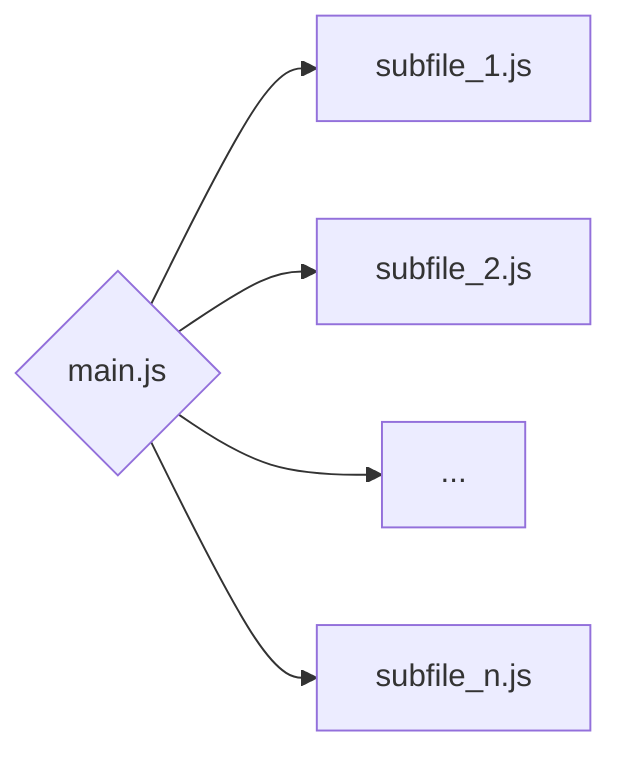
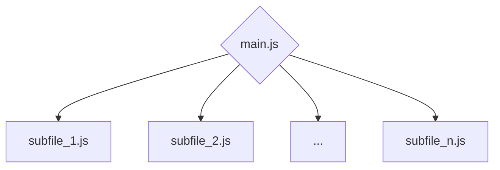

# 高级爬虫：无嵌套webpack的加密方法补环境
webpack是将网站内资源打包的技术，网站所使用的函数被层层封装，因此会给逆向工程带来困难。
现在我以
<a href="https://m.ctyun.cn/wap/main/auth/login?" target="_blank">
这个网站
</a>
为例，对其登录密码加密方法进行逆向，展示了一种对webpack补环境的思路。


<!-- more -->

## 定位加密函数
打开浏览器开发者工具，输入账号密码后点击登录，抓取发送的封包

<div style="text-align: center;">

</div>

可见向服务器发送的封包中，账号没有被加密，但是密码被加密了，我们的目标就是找到其加密方法，
从而可以进行大批量注册、大批量登录等操作，以便我们进一步采集数据。

<div style="text-align: center;">

</div>

接着找到起始位置，在send处打上断点，重新点击登录，断住后向前跟栈，就可以找到加密函数的位置：

<div style="text-align: center;">

</div>

## 分析加密函数
在加密函数处打上断点，重新点击登录，对加密函数进行分析：

```javascript
encodeURI(Object(w["c"])(a.value, Object(w["f"])(Object(w["g"])(r.value))))
```

可以发现其中的`a.value = "test123123"`为明文密码，
`r.value = "123123@163.com"`为明文账号。不用理会`Object`方法，
只需要将里面的`w["c"]`, `w["f"]`和`w["g"]`这三个方法提取出来即可。

## 识别webpack
接下来，直接搜索`w =`可以找到w被赋值的位置：

<div style="text-align: center;">

</div>

在w被赋值的位置上下有很多形如`o('7f6d')`的调用，
出现这种特征有很大概率该网站使用了webpack技术。
在该文件头部代码中可以看到`window["webpackJsonp"]`字样，
可以肯定该网站使用了**webpack技术**，并且是采用**多文件打包**的方式

在多文件打包的结构中，有一个主文件和多个子文件：



其中，主文件中包含方法`o`，称为加载器，其功能是将不同子文件中的方法加载到需要的位置

## 补环境-浏览器环境
接下来需要将加密方法中的`w["c"]`, `w["f"]`和`w["g"]`补齐，使得加密函数能够在浏览器环境下成功运行。

多文件打包的webpack补环境可以分为如下几步：

1. 在主文件中定位加载函数并将其导出到全局作用域
2. 删除主文件中的初始化方法
3. 补充所有子文件的代码
4. 执行加载函数，拿到所需要的加密方法

### 导出加载函数
在w被赋值处，即`w = o("7f6d")`下断点，由于webpack运用了缓存技术，
需要刷新网页才会重新调用`w = o("7f6d")`

断点断住后定位到加载函数的位置，从缩进可以判断加载函数处在局部作用域，需要导出到全局作用域。

将整个主文件复制到本地，在**加载函数和下一个方法之间插入**`debugger;`并运行，
以验证这一部分会被执行：

<div style="text-align: center;">

</div>

如果断点生效了，就可以将断点替换为赋值语句`window.loader_func = u;`，
将加载函数导出到window的全局作用域

### 删除初始化方法
主文件中包含初始化方法，会对浏览器环境进行检测。
初始化方法的位置一定在主文件的主函数的最后几行，在这里是：

<div style="text-align: center;">

</div>

通常初始化方法都涉及**加载函数的调用**，**以及`push`方法的调用**，将其删除即可

### 补充子文件
每个子文件头部都有`window["webpackJsonp"]`字样，在控制台对其输出可以得到全部子文件列表
逐个子文件展开，找到子文件中的任意函数即可定位到子文件的位置。

<div style="text-align: center;">

</div>

接着将每个子文件全部复制到本地的主文件代码后方。

### 执行加载函数
之前已经将加载函数导出到了`window.loader_func`，
接着只需要将向加载函数传入加密函数中w对应的id，即`7f6d`即可将w导出，将相应的代码添加到刚刚的本地代码尾部：

```javascript
var w = window.loader_func('7f6d')
// 将加密函数也添加进来
encodeURI(Object(w["c"])("test123123", Object(w["f"])(Object(w["g"])("123123@163.com"))))
```

至此已经在浏览器中补全了环境，执行脚本即可得到加密后的输出，与抓包的结果一致：

<div style="text-align: center;">

</div>

## 脱离浏览器环境
最后需要将代码脱离浏览器环境，在Python或其他环境中运行。

在其他环境中没有`window`，因此需要先在代码头部定义`window`。在谷歌V8环境中可以使用：

```javascript
window = this;
```

在node.js或Python中则应该使用：

```javascript
window = {}
// 或者
window = global
```

然后运行代码，对报错缺少环境的代码进行删减。代码删减可以遵循如下规则：

1. 所有`&&`(且) 和 `||`(或) 运算都可以删除无法跑通的部分
2. 所有赋值语句都可以将无法跑通的部分赋值为空字符串或空对象
3. 三元表达式需要具体分析，注意第一个`?`总是对应倒数第1个`:`，以此类推

## 简化代码
由于之前的步骤是将网站的全部webpack子文件都添加到了本地代码中，其中很多方法是多余的，
可以将冗余代码剔除。

回顾网站的加载器方法：

```javascript linenums="1" hl_lines="5-10"
function u(n) {
    if (r[n])
        return r[n].exports;
    
    var t = r[n] = {
        i: n,
        l: !1,
        exports: {}
    };
    return e[n].call(t.exports, t, t.exports, u),
    t.l = !0,
    t.exports
}
```

其中第2,3行条件判断表示如果加载的方法已经缓存，则直接从缓存中调用。
高亮部分则表示没有缓存的情况下，将需要加载的方法进行初始化。

!!! tip

    由于我们将加密方法从整个网站中剥离出来了，所以运行本地代码时所有加载的方法都是重新初始化的
    ，也就是通过高亮部分加载

因此，可以在高亮部分，即方法初始化部分将加载的方法以字符串格式导出，
然后将之前所有子文件的代码替换掉，就实现了冗余代码的剥离。

首先观察子文件中方法保存的格式，可以看到是以`'id' : function()`的形式保存的

接着在本地环境头部创建一个全局空字符串，如`window.code = "";`，然后在加载器函数的**方法初始化部分**
仿照方法保存的格式，向全局空字符串中加入被加载到的方法（每次加载器被调用都会触发）：

```javascript linenums="1" hl_lines="10"
function u(n) {
    if (r[n])
        return r[n].exports;
    var t = r[n] = {
        i: n,
        l: !1,
        exports: {}
    };

    window.code += "\"" + n + "\"" + ":" + e[n] + ",";
    
    return e[n].call(t.exports, t, t.exports, u),
    t.l = !0,
    t.exports
}
```

!!! warning

    需要特别注意的是，上述将加载的方法以字符串格式导出的过程需要在本地环境中完成，
    不能在浏览器环境中完成，否则可能会导出浏览器环境相关的冗余代码，导致本地代码执行不成功。


然后在本地环境中的控制台中输出`window.code`，将输出结果复制到**主文件保存方法的位置**，
将原本主文件中的方法替换，并删除所有子文件的内容，在本地环境中成功运行后就完成了代码的简化。

> 在本例中，代码简化能够将原本的30000多行代码缩减到了10000多行